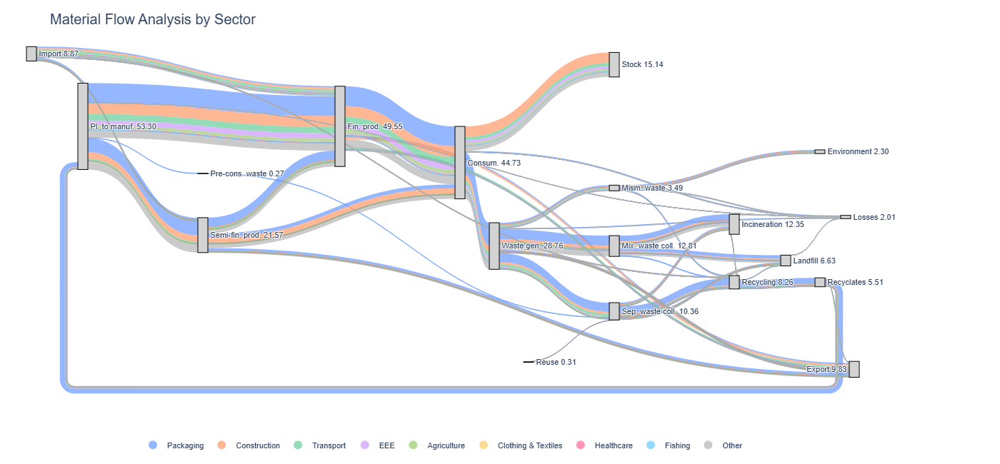

# Plastic-MFA(Material Flow Anlysis)-EU

Reconstructing plastic material flows across the EU economy using Eurostat PRODCOM data and JRC transfer coefficients (Amadei et al,. 2023).

This project develops a Material Flow Analysis (MFA) framework to estimate plastic production, trade, consumption, waste generation, and recycling flows across EU sectors.

The workflow combines:
- Eurostat PRODCOM production and trade statistics
- JRC transfer coefficient methodology
- sector allocation matrices
- Sankey visualization techniques

The objective is to create a reproducible computational workflow for analysing plastic flows in the European economy.

---

# Project Structure

```text
Plastic-MFA-EU/
│
├── data/                 # Input tables and methodological parameters
├── notebooks/            # Jupyter notebook workflows
├── figures/              # Sankey diagrams and visual outputs
├── outputs/              # Generated MFA results
├── src/                  # Reusable Python scripts
├── README.md
└── LICENSE
```

---

# Data Sources

## Eurostat PRODCOM

The project uses Eurostat PRODCOM datasets to estimate:
- production of plastic
- imports of plastic
- exports of plastic
- apparent consumption of plastic

for plastic-containing products across EU sectors.

Main indicators:
- PRODQNT
- IMPQNT
- EXPQNT
- PRODVAL
- IMPVAL
- EXPVAL

---

## JRC Transfer Coefficients

The MFA structure follows the JRC plastic flow methodology:
- semi-finished plastics
- finished products
- sector allocation
- waste generation pathways
- recycling flows

Transfer coefficients are used to distribute plastic flows across:
- packaging
- construction
- transport
- electronics
- agriculture
- textiles
- healthcare
- other sectors

---

# Methodology Workflow

## Step 1 — Data Cleaning and Preparation

The PRODCOM dataset is cleaned and harmonized:
- filtering EU countries
- selecting relevant indicators
- converting units
- removing missing values
- restructuring datasets into analysis-ready format

Notebook:
```text
notebooks/01_mfa_jrc.ipynb
```

---

## Step 2 — Sector Allocation

Plastic-containing products are mapped to economic sectors using:
- sector allocation tables
- plastic content shares
- conversion factors

This step estimates:
- plastic production by sector
- plastic imports by sector
- plastic exports by sector

---

## Step 3 — Semi-Finished to Finished Products

Semi-finished plastic products are distributed into finished product sectors using:
- JRC transfer coefficients
- Table24 allocation shares

This step reconstructs:
- intermediate plastic flows
- sector-specific plastic demand

---

## Step 4 — Apparent Consumption Estimation

Plastic consumption is estimated as:

\[
Consumption = Production + Imports - Exports
\]

The workflow distinguishes:
- direct semi-finished consumption
- finished product consumption
- sectoral consumption patterns

---

## Step 5 — Waste Generation and Recycling Flows

Plastic consumption is translated into:
- waste generation
- recycling flows
- energy recovery
- landfill
- mismanaged waste

using transfer coefficients and waste treatment assumptions.

---

## Step 6 — Sankey Visualization

The MFA results are visualized using Sankey diagrams to represent:
- production flows
- trade flows
- sectoral consumption
- waste generation
- recycling pathways
- recyclates

Outputs include interactive HTML Sankey diagrams.

---

## Example Output



---

# Main Outputs

The project generates:
- sectoral plastic production estimates
- trade-adjusted plastic consumption
- waste generation estimates
- recycling flow estimates
- Sankey diagrams
- transfer coefficient matrices

---

# Software and Libraries

Main Python libraries:
- pandas
- numpy
- plotly
- matplotlib
- openpyxl
- jupyter

---

# Future Improvements

Planned extensions include:
- dynamic MFA over time
- integration with CGE models
- recycling technology differentiation
- regional disaggregation
- circular economy scenario analysis

---

# Author
Amara Zongo  
Researcher in Circular Economy Modelling  
PBL Netherlands Environmental Assessment Agency
